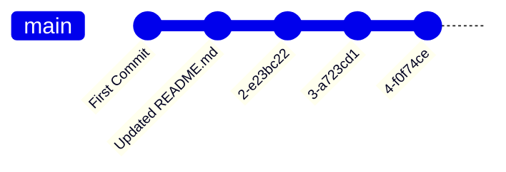
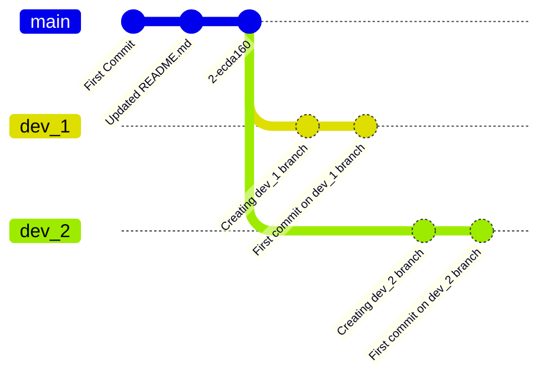

# Qu'est-ce que c'est ?

---
![[Pasted image 20240703145358.png|200]]
C'est un système de gestion de versions, c'est-à-dire de suivi des modifications apportées à un code, un dossier, un projet.

note: Qu'est-ce que ça veut dire? Ca veut dire qu'on peut garder un historique de toutes les modifications, avec leur auteur et des détails.

---

> [!warning] A ne pas confondre
> Git c'est le système, GitHub c'est une __plateforme__ qui héberge des dépôts Git, il y en a d'autres (GitLab par exemple) et en utiliser une n'est pas obligatoire quand on bosse seul, mais il ne faut pas confondre.

note: De même il existe d'autres outils pour simplifier l'utilisation de Git, on peut penser l'intégration dans VSCode ou simplement 

---
## Pourquoi utiliser Git?
![[Pasted image 20240703161036.png|450]]
- Pour travailler à plusieurs <!-- element class="fragment" data-fragment-index="1"-->
- Pour conserver un programme fonctionnel à tout instant <!-- element class="fragment" data-fragment-index="2"-->
- Pour partager son dépôt à des utilisateurs distants <!-- element class="fragment" data-fragment-index="3"-->  
note: Facilité de partage et de contrôle des droits, fonctionnalités qui permettent de s'assurer de pouvoir basculer vers une version fonctionnelle à tout moment, et accessibilité en ligne grâce aux plateformes citées plus haut.
---

# Fonctionnement de Git
---
## Historique git
![[Pasted image 20240704112428.png]]
note: L'historique Git c'est le log de tous les commit (toutes les modifications validées) qui ont été apportés au dépôt. Chaque commit a son propre identifiant, message, et décrit les changements apportés. C'est ça qui nous permet de revenir à d'anciennes versions.

---
## Remote et local repositories
![[Pasted image 20240703161036.png|450]]
note: Je vais vous remettre l'image qu'on avait avant. Ici les dépôts locaux sont ceux sur les ordinateurs des devs, c'est là que sont apportées les modifications. Et le dépôt distant, ou "remote", centralise ces modifications pour permettre leur partage entre les développeurs. Ca se fait très simplement en partageant l'historique entre les dépôts locaux et distants.  
On peut avoir plusieurs dépôts distants pour un dépôt local!

---
## Gitgraph et branches

note: On va commencer par voir le fonctionnement des branches avec un outil très pratique, c'est le git graph. Pour l'instant un dépôt classique au LIS, pour l'instant ça ressemble à ça. Problème, si le code fonctionne pas au 3e commit et que c'est réglé qu'au 5e, ça fonctionne pas pour tout le monde.

--
![[Pasted image 20240704112428.png]]
--
![[Pasted image 20240704113413.png]]
note: En aparté voilà à quoi ressemble le Git Graph de l'historique de tout à l'heure

--
### Branches main et feature/dev

note: Et si on veut revenir au code main, qui a été testé et fonctionne, on peut avec une simple commande sans effacer ce qui a été fait sur la branche dev_1. Plusieurs personnes peuvent être sur plusieurs branches différentes, donc les utilisateurs peuvent toujours utiliser le programme fonctionnel sur main pendant qu'il est développé.

--
### Terminer un développement : merge

note: Et hop! Une fois qu'on a fini de développer et de tester, on réunit les deux branches et tout le monde a accès aux modifications.

--
### Travailler à plusieurs


note: Alors si on est plusieurs à bosser en même temps ça peut ressembler à ça.

--
### Travailler à plusieurs

note: Et si un des développeurs a terminé sa feature, il merge... et là comment on fait?

--
### Suivre le développement des autres : rebase

note: On fait un rebase, c'est presque comme un merge, simplement la branche qui contient les modifications à ajouter est aussi notre branche d'origine. C'est-à-dire qu'on va merge la branche dont est issue notre branche de dev (donc main) dans dev_2. 

--
## Comment on fait?
---
## Installer Git
--
### Vérifier si vous l'avez déjà
```
PS C:\Users\PREVOT Philemon> git version
git version 2.45.0.windows.1
```
--
### Sinon :
- Pour Linux  

```
sudo apt-get install git
```
- Pour Windows  

```
https://git-scm.com/downloads
```
Et télécharger la dernière version pour Windows

---
<i class="fas fa-terminal fa-lg fa-pull-right"></i>
## Commandes de base
note: On va parler ici des commandes Git de base en Interface Commande. Mais il y a de nombreuses interfaces pour utiliser Git (Git Kraken, Github Desktop, VSCode) et, sauf cas particuliers, je les utilise plutôt que les commandes. Mais c'est toujours mieux de pouvoir se débrouiller sans et d'avoir une base commune à tous.

--
<i class="fas fa-terminal fa-lg fa-pull-right"></i>
## Commandes de base
- Clone
+ Add
+ Status
+ Commit
+ Pull
+ Push
+ Branch
+ Checkout
+ Merge

note: Ca fait beaucoup mais ne vous en faites pas, c'est simple et on va y aller doucement.

--
### Git Clone
```
git clone <ssh or url repository> <folder name>
```
Copier un dépôt Git en ligne dans un dossier afin de travailler dessus.  <!-- element class="fragment" data-fragment-index="1" -->  

Petit exemple : <!-- element class="fragment" data-fragment-index="2" -->
```
https://gitlab.lis-lab.fr/philemon.prevot/test_repo.git
```
<!-- element class="fragment" data-fragment-index="3" -->

note: Push un commit une fois qu'ils ont tous cloné le repo

--
### Git Pull
```
git pull <remote name> <branch name>
```

```
git pull origin main
```
<!-- element class="fragment" data-fragment-index="2" -->
Télécharger les modifications ajoutées à un dépôt en ligne par d'autres développeurs.
<!-- element class="fragment" data-fragment-index="3" -->

--
### Git Add
```
git add .
```
```
git add <file name>
```
Ajouter des fichiers et des modifications au suivi Git.

--
### Git Status
```
git status
```
Pour visualiser quelles modifications ont été ajoutées au prochain commit et lesquelles ne seront pas prises en compte.

--
### Git Commit
```
git commit -m "Short description of the changes"
```
Sauvegarder les modifications localement, créer une "version".

note: C'est une bonne pratique de commit à chaque fois que l'on a bien avancé sur un code, qu'on a débuggé une erreur ou effectué une modification importante.

--
### Git Push
```
git push origin master (ou main)
```
Envoyer les versions (commits) sur le dépôt distant (origin) pour les globaliser.

note: On peut push plusieurs commit à la fois, mais si on est nombreux à travailler sur une feature c'est une bonne pratique de push à chaque fois, afin que les autres développeurs puissent suivre l'avancement de votre travail  et adapter le leur si besoin. Une bonne gestion des branches (on verra ça plus tard) permet de limiter la fréquence des pushs.

--
### Git Branch
```
git branch <branch name>
```
Créer une nouvelle branche.

--
### Git Checkout
```
git checkout <branch name>
```
Changer de branche active.

---
# Quelques exemples

--
## Copier un dépôt existant pour travailler dessus
- Clone
+ Pull
note: C'est ce qu'on vient de faire ensemble, et ce que vous allez faire le plus souvent.

--
## Créer un nouveau dépôt à partir d'un dossier existant
- Créer sur Gitlab un dépôt et lui donner le nom souhaité (nom du dossier du dépôt)
+ Dans le dossier du dépôt en local : `git init` pour créer un repo local, puis `git remote add origin <url ou ssh du nouveau dépôt git>` pour ajouter le repo distant en tant qu'origine au repo local.
+ Add
+ Commit
+ Push

--
## Effectuer des modifications directement dans Gitlab
<split even>
- Modifier son fichier avec l'IDE Web
![[Pasted image 20240703184018.png|250]] 
</split> 
<split event>
- Commit (avec le bouton) <!-- element class="fragment" data-fragment-index="2"-->
![[Pasted image 20240703162127.png|400x40]]
</split>

Pas besoin d'add, Gitlab le fait tout seul, et pas besoin de push non plus. <!-- element class="fragment" data-fragment-index="3"-->
note: Au LIS on bosse sur GitLab parce que ça permet un accès plus restreint aux dépôts que GitHub, c'est destiné aux entreprises et moins aux développeurs en free-lance.

--
## .gitignore
![[Pasted image 20240704115130.png]]
note: Ca, c'est le Graal des gens qui utilisent git. Comme le nom l'indique, il permet de choisir des dossiers ou des fichiers à faire ignorer par git. Si on ne souhaite pas mettre ses dossiers de test ou ses données expérimentales par exemple, ce qui est quand même mieux, parce que git c'est pas fait pour être un drive.

---
## Workflow

--
### Git Flow
 - Une branche __main__ (ou master) qui est la branche déployée
 + Une branche **dev** qui est la branche sur laquelle les développeurs mergent leurs travaux
 + Des branches **feature** sur lesquelles les devs travaillent

--
### Git Flow
Les branches __feature__ sont merge dans __dev__ à chaque fois que le développement de la feature en question est terminé. Mais la branche __dev__ n'est merge sur __main__ que lorsqu'on souhaite publier une nouvelle version du code. De plus elle est merge avec un nom de version.

--
### Git Flow

note: Ca ressemble à ça, et l'avantage c'est que c'est très safe, c'est-à-dire que le code disponible pour les utilisateurs ne peut pas contenir d'erreurs dues au développement si les phases de test sont bien faites. CEPENDANT, bien qu'on ait besoin que notre code soit "industriel", on a quand même pas besoin d'un tel niveau de sécurité. Et l'inconvénient de cette méthode c'est que 1) tout le monde ici n'est pas un professionnel de Git et c'est un peu complexe 2) ça espace beaucoup les release et donc la disponibilité de meilleurs codes pour les utilisateurs. Ce que je propose donc...

---
### GitHub Flow
- Une branche __main__ (ou master) qui est la branche déployée
+ Des branches __feature__ sur lesquelles les branches travaillent et qui sont merge dans __main__ quand les features sont terminées.

note: Beaucoup plus simple, moins safe, mais je pense que ça sera parfaitement suffisant pour nous. Et... surprise! C'est d'ailleurs le workflow que je vous ai montré depuis le début!

--
### GitHub Flow

---
# Merci pour votre attention!
Des questions?

---